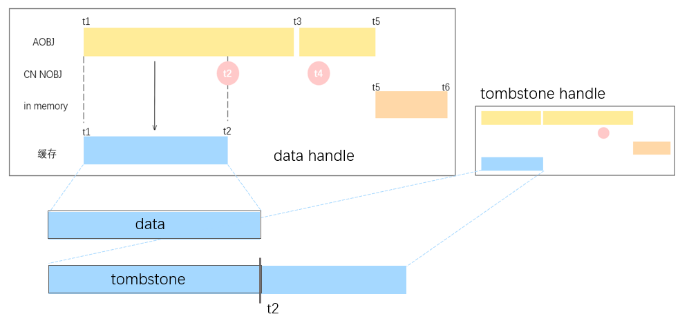
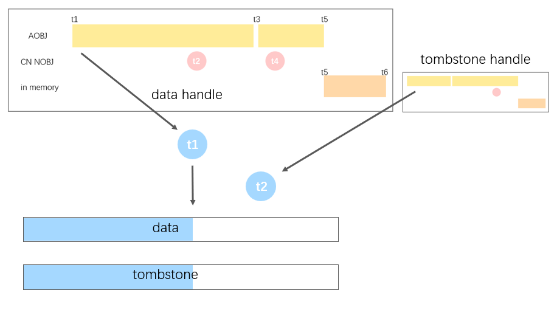

# CDC Changes Handle设计

## 需求分析

### Changes Handle接口 

每次新建一个ChangesHandle，收集start，end之间的数据。调用ChangesHandle.Next()会返回两个batch：1. data是插入的数据，2. tombstone是删除的数据。
```
CollectChanges(ctx context.Context, from, to types.TS, mp *mpool.MPool) (ChangesHandle, error)
type ChangesHandle interface {
    Next()(data *batch.Batch,tombstone *batch.Batch,Hint,error)
    Close() error
}
```
### 消费顺序

1. ts不相同时，先消费ts小的

2. ts相同时，先消费删除

      在一个事务中，对某个pk先插入后删除会在提交时合并掉。所以同一个事务中，对某个Pk既有插入又有删除，删除操作一定在前。

### 返回结果类型

ChangesHandle.Next()的返回结果有三种类型：

1. Snapshot
    * 这个handle每次next的返回结果，都只有data，没有tombstone，可以直接消费。
    * 是一个特殊优化，如果start为0，就会返回这种类型。
2. Tail_WIP
    * 可能和后续的batch顺序交叉，要缓存在内存里。
3. Tail_Done
    * 不会与后续返回的batch顺序交叉，可以消费之前缓存的data和tombstone。

## 实现

### Snapshot

当start为0时，相当于直接读取end时间的数据。可以通过现有的接口直接读取。

### Tail

#### 特殊优化

这些场景可以直接消费，不用排序
1. data和tombstone都很小，只用调用一次ChangesHandle.Next
2. 只有tombstone或只有data

#### 其他场景

partition state里有这些数据：
    
1.  内存中的数据
     * 事务数据量较小时TN会把数据写入aobj，提交后存到Partition state的内存里
2. appendable object(AOBJ)
     * 一段时间后，AOBJ会刷盘，CN会存AOBJ的信息
     * AOBJ之间的数据时间上没有交叉
     * 一个AOBJ中包含多个事务多个时间戳
3. CN写的nonappendable object(CN NAOBJ)
     * 数据量较大时，CN会写文件，把文件发给TN提交
     * 一个CN NAOBJ只包含一个事务
     * 一个CN NAOBJ可能在一个AOBJ里的某两个事务之间提交，AOBJ和CN NAOBJ的时间可能交叉。如果要按时间顺序收集，一个aobj里的数据不能一次性全拿，可能要先收集一部分，再收集某个cnnaobj的数据，再收集剩下的
4. TN merge产生的nonappendable object
     * 数据和被merge的Object重复，不用收集



收集步骤：
1. 为tombstone和data各自建三个handle，每个handle内部的数据是排序的。
    1. AOBJ handle：
        先按照AOBJ的create TS排序，每次读一个AOBJ缓存到内存中。刷盘的Tombstone的AOBJ是按row id排序的，读上来后需要按时间排序。
    2. CN handle: 按create TS排序。
    3. In memory handle: 按每行的commit TS排序。
2. 为data(或tombstone)收集1-2个batch。
    1. 取三个handle各自的nextTS（AOBJ: t1，CN NOBJ：t2，in memory：t3）。
    2. 取nextTS最小的handle，收集第二小的nextts前的数据（AOBJ handle里t1-t2的数据）放到缓存里。
    3. 一直重复，直到缓存里有足够多的数据（8192-16384行）
3. 比较data和tombstone缓存数据的最大TS。对于ts较大的batch（tombstone），只发送前半部分。完整地发送另一个batch（data）。

## 遇到的问题

 ### merge transfer产生的tombstone导致重复删除

 一次merge对应一个事务。obj1 merge成obj2，会收集obj1上事务startts之前的数据和tombstone，消费tombstone并且排序之后写到obj2上。事务startts到committs之间的tombstone还没消费过，所以提交时，会把它们transfer到obj2上。这些transfer的tombstone，和普通的删除都会写入aobj。ChangesHandle会误读这些tombstone。
 例如这种情况，ChangeHandle会依次收集到tombstone1，data1，tombstone2，这个pk会被误删。
 
 ```
  merge start           update commit          merge commit
                              |                     |
  ----------------------------+---------------------+---------------------------->
                              |                     |
                         tombstone 1            tombstone2(transfer)
                          data1
 ```

 * 解决方案 
 1. 用obj的delete ts过滤

     因为删除旧的obj和transfer tombstone属于一个事务，它们的committs一定相等。dn所有事务的committs都有唯一的committs。
     所以如果tombstone的committs和某个obj的delete time相同，它就是transfer的tombstone。

 2. 记录tombstone是否是merge产生的
 
### 大量删除的transfer产生重复的tombstone
 如果删除事务的startts和committs之间，对应的obj被merge掉了，这个tombstone要transfer到新的object上。

 ```
  update start           merge commit          update commit
                                                    |
  --------------------------------------------------+---------------------------->
                                                    |
                                                tombstone1
                                                tombstone2(transfer)
 ```
 在数据量较大的删除里，如果cn写的文件里部分需要transfer，剩下的不需要，会保留原来的文件。transfer产生的tombstone会和原来文件里的tombstone重复。

* 解决方案：
    1. sinker里这个是幂等的。因为同一个事务里，这两次删除之间一定没有插入，第一次删除后对应的pk已经不存在了，第二次删除会失败，不影响数据
    2. 在ChangesHandle里按rowid去重。但是数据量可能会很大，可能内存和性能上有问题。

### Tail很大
 当Tail数据很多，事务数量很大的时候，之前的实现性能上有问题。

 之前的实现：
 1. 准备 AOBJ handle，in memory handle，CN NAOBJ handle
 2. 检查data和tombstone中6个handle的ts, 取ts最小的handle，收集一个事务的数据。
 3. 一直循环，直到拿到8192行

    

    现在的实现中拿第二小的nextts去收集一段时间内的数据，能减少数据拷贝和比较ts的次数。

### partition state gc之后不完整(现在只保留1h内的数据)
 obj软删超过1h后会从partition state中gc掉。changeshandle无法读取start很旧的数据，只能删掉现有数据，用Snapshot的方式重新读全量数据。
 解决方案是从checkpoint里取mints前的数据，但是gckp之前的数据还是取不到。
 
